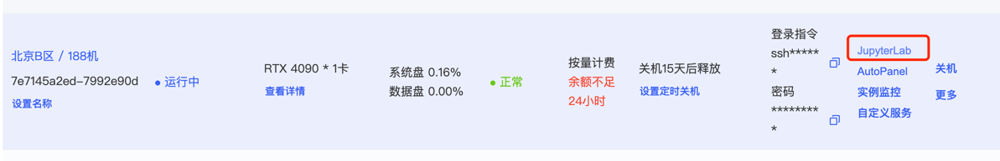
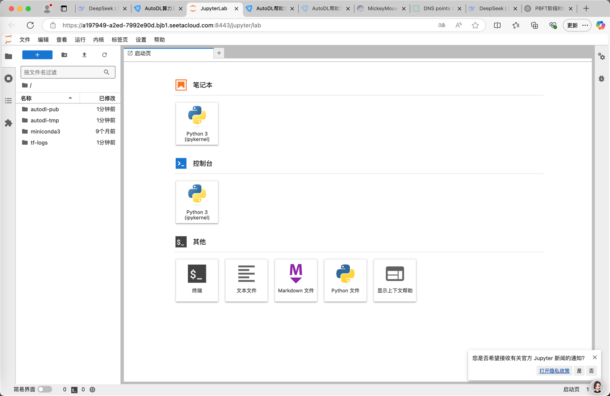
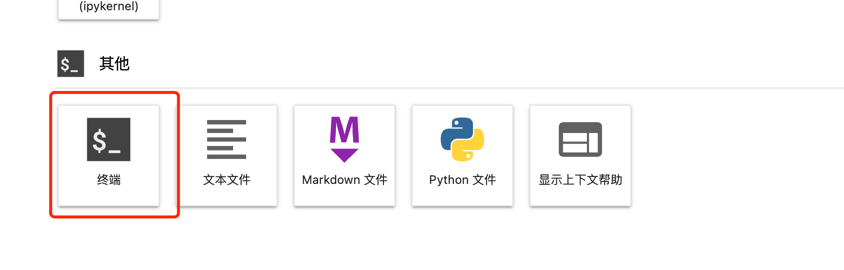
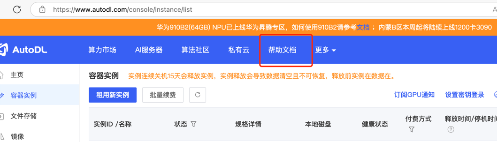
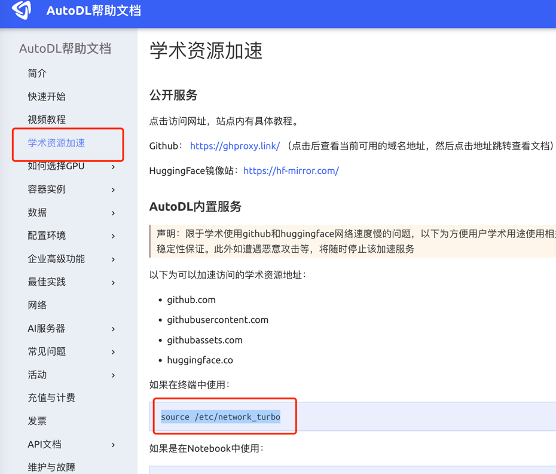
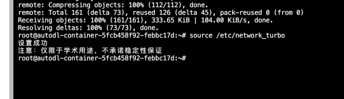

## 1. 选机子

只要是有卡的就行，一般在 一块多～两块/h 左右是正常的，镜像方面，选择我共享给你们的那个：


## 2. 开机子

如果用我镜像的话，需要等待一段时间，可能半个小时？挂着干其他活就行

* 点击这个开启机子



* 会看到这样的画面：


* 点击终端：



## 3. 进入LLM_RAG_Clangugae

```bash
cd LLM_RAG_Clangugae/chat/

```

* 可以输入`ls`查看当前有啥文件，也可以双击左边的边栏，看里面有什么（直接点击前面的文件就能返回去原本的路径下）


## 3. 启动 `ollama`

```bash
ollama serve
```


## 4. 下载 qwen2

```bash
ollama pull qwen2
```

```bash
ollama pull nomic-embed-text:latest
```


如果很慢，或者下载不了，可以点击帮助文档：






复制这段话到终端中，进行输入：



